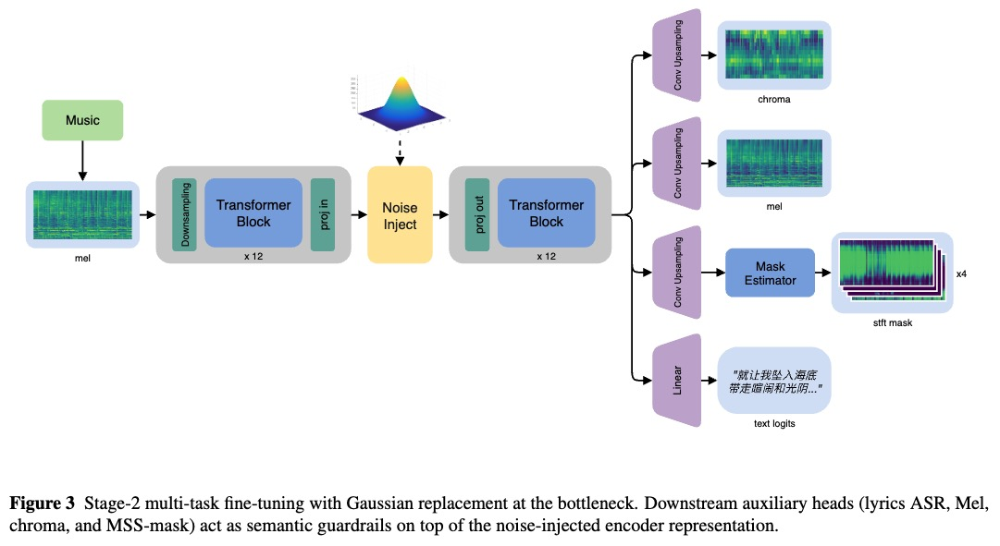
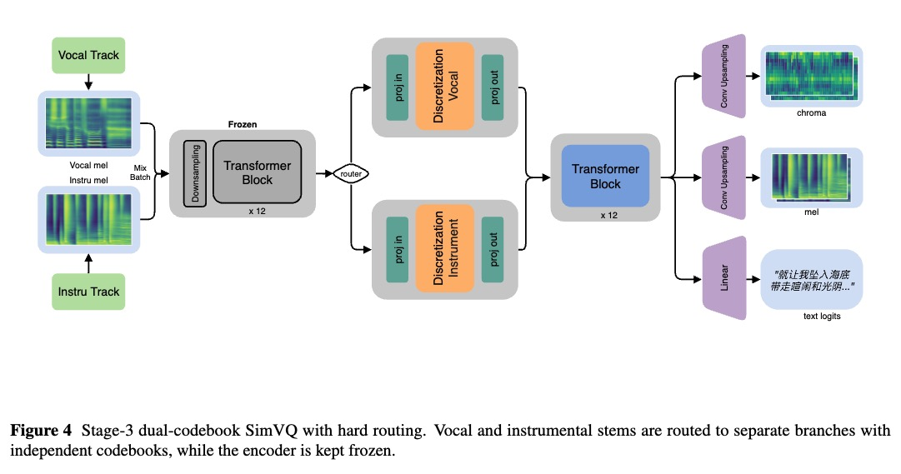
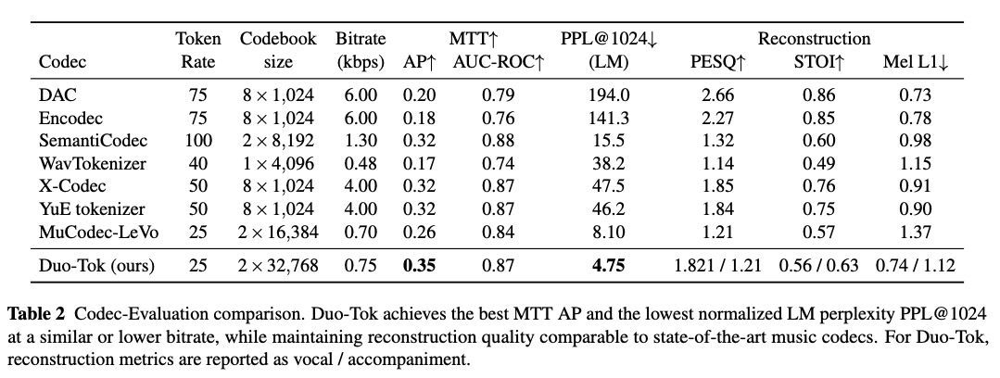

# Duo-Tok: Dual-Track Semantic Music Tokenizer for Vocal–Accompaniment Generation

<p align="center">
  <a href="https://arxiv.org/abs/2511.20224"></a>
  <a href="https://github.com/Eps-Acoustic-Revolution-Lab/DUO_TOK"></a>
</p>

> Official repository for **“Duo-Tok: Dual-Track Semantic Music Tokenizer for Vocal–Accompaniment Generation.”**

Duo-Tok is a source-aware dual-codebook tokenizer for vocal–accompaniment music.  
It follows a four-stage, SSL-centered pipeline:

1. **BEST-RQ–style SSL pre-training** to learn musical semantic representations.
2. **Multi-task fine-tuning with Gaussian replacement noise** to stabilize and factorize encoder features.
3. **SimVQ-based dual codebooks** with hard routing for vocals and accompaniment.
4. **Latent diffusion decoder** on an ear-VAE latent space for high-fidelity 48 kHz reconstruction at ~0.75 kbps.

On unified codec benchmarks, Duo-Tok shifts the reconstruction–generation Pareto frontier by achieving low LM perplexity while maintaining competitive reconstruction quality, and it supports dual-track and vocal-conditioned accompaniment language modeling.

---

## Repository status

We are still preparing the open-source release (code refactoring, license checks, and model packaging).

For now, this repository only contains:

- `README.md` – high-level description of the project.
- `docs/` – project website and documentation (served via GitHub Pages, to be gradually updated).

> **Code and checkpoints are not yet released.**  
> Inference pipelines, and pre-trained models will be added here once they are ready.

---

## Resources

- 📄 **Paper**: [arXiv preprint](https://arxiv.org/abs/2511.20224)
- 🌐 **Project page**: [Demo Page](https://github.com/Eps-Acoustic-Revolution-Lab/DUO_TOK)

---

## High-level overview

Duo-Tok is designed to provide music tokens that are:

- **Source-aware**  
  - Separate codebooks for vocal and accompaniment stems.  
  - Better support for dual-track LMs and cross-track conditioning (e.g., vocal-conditioned accompaniment).

- **LM-friendly**  
  - Gaussian replacement noise and progressive freezing encourage smoother, more predictable discrete sequences.  
  - Lower vocabulary-normalized LM perplexity (PPL@1024) under lightweight Transformers.

- **Reconstructable**  
  - Latent diffusion decoder over ear-VAE latents for high-fidelity 48 kHz audio at ultra-low bitrate (~0.75 kbps).

- **Multi-task aligned**  
  - Stage-2 uses ASR for lyric alignment, Mel and chroma reconstruction, and MSS masks as semantic guardrails, so the tokenizer keeps style, instrumentation, and structure.

For architectural details and experiments, please refer to the paper and the documentation in `docs/`.

### Core Architecture Overview

**Stage 2: Multi-task Fine-tuning**


**Stage 3: Dual Codebook and Latent Diffusion Decoder**


**Performance Comparison**


---

## Planned release

We plan to release, in stages:

1. **Inference code** for tokenization and decoding from Duo-Tok tokens.  
2. **Pre-trained checkpoints** for the SSL encoder, dual codebooks, and diffusion decoder.  

The exact timeline depends on internal cleanup and licensing; updates will be posted in this repository’s Issues and Releases.

---

## Citation

If you find Duo-Tok useful in your research, please consider citing:

```bibtex
@misc{lin2025duotokdualtracksemanticmusic,
      title={DUO-TOK: Dual-Track Semantic Music Tokenizer for Vocal-Accompaniment Generation}, 
      author={Rui Lin and Zhiyue Wu and Jiahe Le and Kangdi Wang and Weixiong Chen and Junyu Dai and Tao Jiang},
      year={2025},
      eprint={2511.20224},
      archivePrefix={arXiv},
      primaryClass={cs.SD},
      url={https://arxiv.org/abs/2511.20224}, 
}
```

